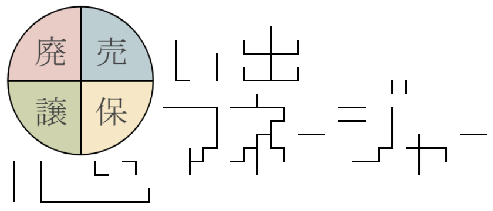
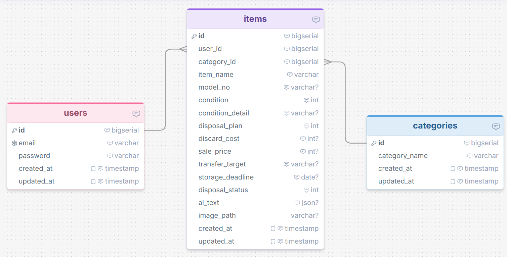
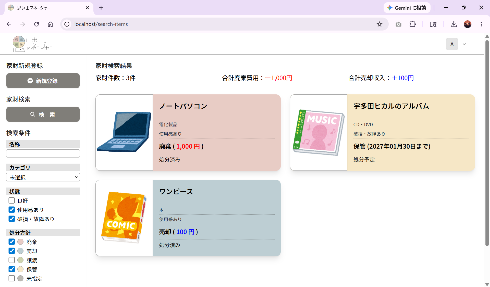
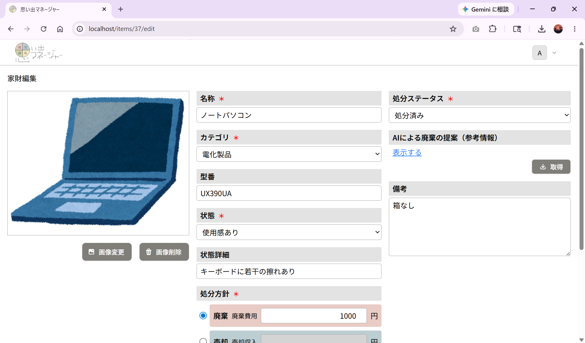
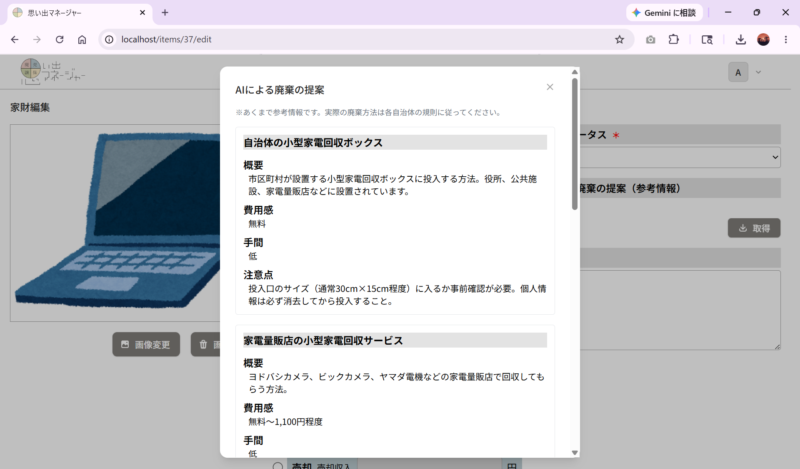

# 思い出マネージャー

 

## アプリ概要
思い出の品々（家財）を「廃棄」「売却」「譲渡」「保管」の４つの処分方針から選択して登録し、管理するアプリです。

### 本アプリの作成背景
私情により、地元に戻って生活することになりましたが、実家にあふれかえる家財（※ほぼゴミ）の多さに絶望しました。 
親に処分を打診しましたが拒否されたため、処分が可能になるタイミングが来たときに備えて処分方針を記録しておくことで、不安を軽減することを試みました。

 

## URL

 

## 使用技術
- PHP 8.4
- Laravel 12
- Livewire 3
- Flux UI
- PostgreSQL
- Docker / Laravel Sail
- Tailwind CSS

 

## 機能一覧
- ユーザー登録・ログイン
- 家財の登録・編集・照会・削除
- 家財の検索・絞り込み
- 画像のアップロード
- AIによる廃棄方法の提案（参考程度）

 

## ER図

 

## 画面サンプル

### 家財検索画面

### 家財編集画面

### AIの廃棄の提案ウィンドウ

 

## 仕様説明
本アプリの特徴となる一部の仕様は以下の通りです。

### 1. 各処分方針に付随する登録項目について
本アプリでは、家財の処分方針を「廃棄」「売却」「譲渡」「保管」のいずれかから選択し、処分方針に応じて以下の内容を登録できます。

- 廃棄（廃棄費用）
    - 粗大ごみ券の購入など、家財の廃棄時に発生する支出金額を数値で入力します。
- 売却（売却収入）
    - リサイクルショップでの売却益など、家財の売却時に発生する収入金額を数値で入力します。
- 譲渡（譲渡先）
    - 家族や友人など、家財を譲渡する先の続柄や氏名等を文字列で入力します。
- 保管（保管期限）
    - 家財を保管する期限を日付で入力します。

### 2. AIによる廃棄方法の提案について
家財の中には「こんなものどうやって捨てたらいいんだ」と悩むものがあると思われます。 
家財登録・編集画面では、入力された家財情報をもとにAIに問い合わせ、廃棄方法の提案を受け取ることができます。 
AIの問い合わせに使用する項目は以下の5つです。
- 名称
- カテゴリ
- 型番
- 状態
- 状態詳細

※ただし、AIからの回答は参考程度とし、実際の廃棄方法については各自治体の規則に従うものとします。

 

## 機能拡張について
本アプリに対して以下のような機能拡張ができれば、さらなる利便性や実用性の向上が見込めると想定しています。

### 1. マルチユーザーによる管理
現在はシングルユーザーでの管理となりますが、グループを作成してマルチユーザーでの管理を可能にしたいです。 
これにより、家族みんなで管理を行い、負荷分散や登録作業の促進が期待できると想定しています。 
 
要：ユーザーマイページ、管理者ページ、グループIDの管理、管理者・メンバーのロール管理、など

### 2. コメント機能
マルチユーザーでの管理に付随して、コメント機能によるグループ内のメッセージのやり取りを可能にしたいです。 
これにより、ある家財の処分方針を決定するにあたって、外部ツールでメッセージを送って持ち主に問い合わせる手間を削減し、本アプリ内で処分方針の決定が完結できると想定しています。

要：コメントテーブル、コメント投稿者の管理・表示、など
